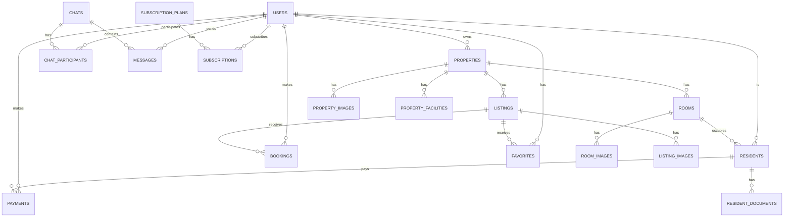

# 📊 ERD Requirement Document
## Database Schema - Sistem Informasi KosanHub

---

## 1. Entity Relationship Diagram



---

## 2. Detailed Table Schemas

### 2.1 USERS
```sql
CREATE TABLE users (
    id              UUID PRIMARY KEY DEFAULT gen_random_uuid(),
    email           VARCHAR(255) UNIQUE NOT NULL,
    phone           VARCHAR(20) UNIQUE NOT NULL,
    password_hash   VARCHAR(255) NOT NULL,
    name            VARCHAR(255) NOT NULL,
    role            VARCHAR(20) NOT NULL CHECK (role IN ('SUPER_ADMIN', 'OWNER', 'TENANT', 'BUYER', 'AGENT')),
    avatar_url      TEXT,
    
    -- Identity
    ktp_number      VARCHAR(20),
    ktp_image_url   TEXT,
    selfie_url      TEXT,
    date_of_birth   DATE,
    gender          VARCHAR(10) CHECK (gender IN ('MALE', 'FEMALE')),
    address         TEXT,
    
    -- Business Info (for OWNER)
    business_name   VARCHAR(255),
    business_address TEXT,
    npwp            VARCHAR(30),
    
    -- Status
    is_verified     BOOLEAN DEFAULT FALSE,
    is_active       BOOLEAN DEFAULT TRUE,
    email_verified_at TIMESTAMP,
    phone_verified_at TIMESTAMP,
    
    -- Timestamps
    created_at      TIMESTAMP DEFAULT CURRENT_TIMESTAMP,
    updated_at      TIMESTAMP DEFAULT CURRENT_TIMESTAMP,
    deleted_at      TIMESTAMP,
    deleted_by      UUID REFERENCES users(id)
);
```

### 2.2 PROPERTIES
```sql
CREATE TABLE properties (
    id              UUID PRIMARY KEY DEFAULT gen_random_uuid(),
    owner_id        UUID NOT NULL REFERENCES users(id),
    
    -- Basic Info
    name            VARCHAR(255) NOT NULL,
    type            VARCHAR(20) NOT NULL CHECK (type IN ('KOS', 'KONTRAKAN', 'VILLA', 'HOUSE', 'LAND')),
    description     TEXT,
    
    -- Location
    address         TEXT NOT NULL,
    province        VARCHAR(100) NOT NULL,
    city            VARCHAR(100) NOT NULL,
    district        VARCHAR(100),
    subdistrict     VARCHAR(100),
    postal_code     VARCHAR(10),
    latitude        DECIMAL(10, 8),
    longitude       DECIMAL(11, 8),
    
    -- Specifications
    land_area       INTEGER, -- in m²
    building_area   INTEGER, -- in m²
    total_rooms     INTEGER DEFAULT 0,
    total_floors    INTEGER DEFAULT 1,
    year_built      INTEGER,
    certificate     VARCHAR(20) CHECK (certificate IN ('SHM', 'HGB', 'AJB', 'GIRIK', 'STRATA', 'OTHER')),
    
    -- Settings
    is_published    BOOLEAN DEFAULT FALSE,
    
    -- Timestamps
    created_at      TIMESTAMP DEFAULT CURRENT_TIMESTAMP,
    updated_at      TIMESTAMP DEFAULT CURRENT_TIMESTAMP,
    deleted_at      TIMESTAMP,
    deleted_by      UUID REFERENCES users(id)
);
```

### 2.3 ROOMS
```sql
CREATE TABLE rooms (
    id              UUID PRIMARY KEY DEFAULT gen_random_uuid(),
    property_id     UUID NOT NULL REFERENCES properties(id),
    
    -- Basic Info
    name            VARCHAR(100) NOT NULL, -- e.g., "Kamar 1A"
    floor           INTEGER DEFAULT 1,
    room_size       INTEGER, -- in m²
    
    -- Pricing
    price_daily     DECIMAL(15, 2),
    price_monthly   DECIMAL(15, 2),
    price_yearly    DECIMAL(15, 2),
    deposit         DECIMAL(15, 2),
    
    -- Status
    status          VARCHAR(20) DEFAULT 'AVAILABLE' CHECK (status IN ('AVAILABLE', 'OCCUPIED', 'MAINTENANCE', 'RESERVED')),
    is_active       BOOLEAN DEFAULT TRUE,
    
    -- Timestamps
    created_at      TIMESTAMP DEFAULT CURRENT_TIMESTAMP,
    updated_at      TIMESTAMP DEFAULT CURRENT_TIMESTAMP,
    deleted_at      TIMESTAMP,
    deleted_by      UUID REFERENCES users(id)
);
```

### 2.4 RESIDENTS (PRIVATE DATA)
```sql
CREATE TABLE residents (
    id              UUID PRIMARY KEY DEFAULT gen_random_uuid(),
    property_id     UUID NOT NULL REFERENCES properties(id),
    room_id         UUID REFERENCES rooms(id),
    user_id         UUID REFERENCES users(id),
    
    -- Personal Info (Private)
    full_name       VARCHAR(255) NOT NULL,
    ktp_number      VARCHAR(20) NOT NULL,
    ktp_image_url   TEXT,
    selfie_url      TEXT,
    date_of_birth   DATE,
    place_of_birth  VARCHAR(100),
    gender          VARCHAR(10) CHECK (gender IN ('MALE', 'FEMALE')),
    religion        VARCHAR(50),
    marital_status  VARCHAR(20) CHECK (marital_status IN ('SINGLE', 'MARRIED', 'DIVORCED', 'WIDOWED')),
    occupation      VARCHAR(100),
    phone           VARCHAR(20),
    email           VARCHAR(255),
    origin_address  TEXT,
    
    -- Emergency Contact
    emergency_name  VARCHAR(255),
    emergency_relation VARCHAR(50),
    emergency_phone VARCHAR(20),
    emergency_address TEXT,
    
    -- Rental Info
    check_in_date   DATE NOT NULL,
    check_out_date  DATE,
    rental_price    DECIMAL(15, 2) NOT NULL,
    deposit_amount  DECIMAL(15, 2),
    deposit_status  VARCHAR(20) DEFAULT 'PAID' CHECK (deposit_status IN ('PENDING', 'PAID', 'RETURNED', 'FORFEITED')),
    payment_due_day INTEGER DEFAULT 1, -- 1-31
    rental_status   VARCHAR(20) DEFAULT 'ACTIVE' CHECK (rental_status IN ('ACTIVE', 'ENDED', 'SUSPENDED')),
    notes           TEXT,
    
    -- Timestamps
    created_at      TIMESTAMP DEFAULT CURRENT_TIMESTAMP,
    updated_at      TIMESTAMP DEFAULT CURRENT_TIMESTAMP,
    deleted_at      TIMESTAMP,
    deleted_by      UUID REFERENCES users(id)
);
```

### 2.5 RESIDENT_DOCUMENTS
```sql
CREATE TABLE resident_documents (
    id              UUID PRIMARY KEY DEFAULT gen_random_uuid(),
    resident_id     UUID NOT NULL REFERENCES residents(id),
    
    document_type   VARCHAR(50) NOT NULL CHECK (document_type IN ('KTP', 'KK', 'CONTRACT', 'OTHER')),
    document_name   VARCHAR(255) NOT NULL,
    document_url    TEXT NOT NULL,
    drive_file_id   VARCHAR(100),
    
    created_at      TIMESTAMP DEFAULT CURRENT_TIMESTAMP,
    updated_at      TIMESTAMP DEFAULT CURRENT_TIMESTAMP,
    deleted_at      TIMESTAMP,
    deleted_by      UUID REFERENCES users(id)
);
```

### 2.6 PAYMENTS
```sql
CREATE TABLE payments (
    id              UUID PRIMARY KEY DEFAULT gen_random_uuid(),
    resident_id     UUID NOT NULL REFERENCES residents(id),
    property_id     UUID NOT NULL REFERENCES properties(id),
    
    -- Payment Info
    payment_type    VARCHAR(30) NOT NULL CHECK (payment_type IN ('RENT', 'DEPOSIT', 'UTILITY', 'OTHER')),
    amount          DECIMAL(15, 2) NOT NULL,
    period_start    DATE,
    period_end      DATE,
    due_date        DATE,
    paid_date       TIMESTAMP,
    
    -- Payment Method
    payment_method  VARCHAR(30) CHECK (payment_method IN ('CASH', 'BANK_TRANSFER', 'EWALLET', 'CARD')),
    payment_proof_url TEXT,
    
    -- Status
    status          VARCHAR(20) DEFAULT 'PENDING' CHECK (status IN ('PENDING', 'PAID', 'OVERDUE', 'CANCELLED')),
    notes           TEXT,
    
    -- Verification
    verified_by     UUID REFERENCES users(id),
    verified_at     TIMESTAMP,
    
    created_at      TIMESTAMP DEFAULT CURRENT_TIMESTAMP,
    updated_at      TIMESTAMP DEFAULT CURRENT_TIMESTAMP,
    deleted_at      TIMESTAMP,
    deleted_by      UUID REFERENCES users(id)
);
```

### 2.7 CHATS
```sql
CREATE TABLE chats (
    id              UUID PRIMARY KEY DEFAULT gen_random_uuid(),
    property_id     UUID REFERENCES properties(id),
    listing_id      UUID REFERENCES listings(id),
    
    chat_type       VARCHAR(20) DEFAULT 'DIRECT' CHECK (chat_type IN ('DIRECT', 'PROPERTY', 'LISTING')),
    last_message_at TIMESTAMP,
    
    created_at      TIMESTAMP DEFAULT CURRENT_TIMESTAMP,
    updated_at      TIMESTAMP DEFAULT CURRENT_TIMESTAMP,
    deleted_at      TIMESTAMP,
    deleted_by      UUID REFERENCES users(id)
);
```

### 2.8 CHAT_PARTICIPANTS
```sql
CREATE TABLE chat_participants (
    id              UUID PRIMARY KEY DEFAULT gen_random_uuid(),
    chat_id         UUID NOT NULL REFERENCES chats(id),
    user_id         UUID NOT NULL REFERENCES users(id),
    
    role            VARCHAR(20) DEFAULT 'MEMBER' CHECK (role IN ('OWNER', 'MEMBER')),
    is_blocked      BOOLEAN DEFAULT FALSE,
    blocked_at      TIMESTAMP,
    last_read_at    TIMESTAMP,
    
    created_at      TIMESTAMP DEFAULT CURRENT_TIMESTAMP,
    updated_at      TIMESTAMP DEFAULT CURRENT_TIMESTAMP,
    deleted_at      TIMESTAMP,
    deleted_by      UUID REFERENCES users(id),
    
    UNIQUE(chat_id, user_id)
);
```

### 2.9 MESSAGES
```sql
CREATE TABLE messages (
    id              UUID PRIMARY KEY DEFAULT gen_random_uuid(),
    chat_id         UUID NOT NULL REFERENCES chats(id),
    sender_id       UUID NOT NULL REFERENCES users(id),
    
    message_type    VARCHAR(20) DEFAULT 'TEXT' CHECK (message_type IN ('TEXT', 'IMAGE', 'DOCUMENT', 'SYSTEM')),
    content         TEXT,
    media_url       TEXT,
    drive_file_id   VARCHAR(100),
    
    is_read         BOOLEAN DEFAULT FALSE,
    read_at         TIMESTAMP,
    
    created_at      TIMESTAMP DEFAULT CURRENT_TIMESTAMP,
    updated_at      TIMESTAMP DEFAULT CURRENT_TIMESTAMP,
    deleted_at      TIMESTAMP,
    deleted_by      UUID REFERENCES users(id)
);
```

### 2.10 LISTINGS (Marketplace)
```sql
CREATE TABLE listings (
    id              UUID PRIMARY KEY DEFAULT gen_random_uuid(),
    owner_id        UUID NOT NULL REFERENCES users(id),
    property_id     UUID REFERENCES properties(id),
    
    -- Basic Info
    title           VARCHAR(255) NOT NULL,
    listing_type    VARCHAR(20) NOT NULL CHECK (listing_type IN ('RENT', 'SALE')),
    property_type   VARCHAR(20) NOT NULL CHECK (property_type IN ('KOS', 'KONTRAKAN', 'VILLA', 'HOUSE', 'LAND')),
    description     TEXT,
    
    -- Location
    address         TEXT NOT NULL,
    province        VARCHAR(100) NOT NULL,
    city            VARCHAR(100) NOT NULL,
    district        VARCHAR(100),
    latitude        DECIMAL(10, 8),
    longitude       DECIMAL(11, 8),
    
    -- Specifications
    land_area       INTEGER,
    building_area   INTEGER,
    bedrooms        INTEGER,
    bathrooms       INTEGER,
    floors          INTEGER DEFAULT 1,
    certificate     VARCHAR(20),
    condition       VARCHAR(20) CHECK (condition IN ('NEW', 'GOOD', 'RENOVATED', 'NEEDS_REPAIR')),
    furnished       VARCHAR(20) CHECK (furnished IN ('UNFURNISHED', 'SEMI', 'FULLY')),
    
    -- Pricing
    price           DECIMAL(15, 2) NOT NULL,
    price_period    VARCHAR(20) CHECK (price_period IN ('DAILY', 'MONTHLY', 'YEARLY', 'ONCE')),
    is_negotiable   BOOLEAN DEFAULT TRUE,
    deposit         DECIMAL(15, 2),
    
    -- Status
    status          VARCHAR(20) DEFAULT 'DRAFT' CHECK (status IN ('DRAFT', 'ACTIVE', 'PENDING', 'SOLD', 'RENTED', 'EXPIRED')),
    views           INTEGER DEFAULT 0,
    featured        BOOLEAN DEFAULT FALSE,
    expires_at      TIMESTAMP,
    
    created_at      TIMESTAMP DEFAULT CURRENT_TIMESTAMP,
    updated_at      TIMESTAMP DEFAULT CURRENT_TIMESTAMP,
    deleted_at      TIMESTAMP,
    deleted_by      UUID REFERENCES users(id)
);
```

### 2.11 LISTING_FACILITIES
```sql
CREATE TABLE listing_facilities (
    id              UUID PRIMARY KEY DEFAULT gen_random_uuid(),
    listing_id      UUID NOT NULL REFERENCES listings(id),
    
    facility_code   VARCHAR(50) NOT NULL, -- AC, WIFI, PARKING, etc.
    facility_name   VARCHAR(100) NOT NULL,
    
    created_at      TIMESTAMP DEFAULT CURRENT_TIMESTAMP,
    deleted_at      TIMESTAMP,
    deleted_by      UUID REFERENCES users(id)
);
```

### 2.12 LISTING_IMAGES
```sql
CREATE TABLE listing_images (
    id              UUID PRIMARY KEY DEFAULT gen_random_uuid(),
    listing_id      UUID NOT NULL REFERENCES listings(id),
    
    image_url       TEXT NOT NULL,
    drive_file_id   VARCHAR(100),
    caption         VARCHAR(255),
    is_primary      BOOLEAN DEFAULT FALSE,
    sort_order      INTEGER DEFAULT 0,
    
    created_at      TIMESTAMP DEFAULT CURRENT_TIMESTAMP,
    deleted_at      TIMESTAMP,
    deleted_by      UUID REFERENCES users(id)
);
```

### 2.13 BOOKINGS
```sql
CREATE TABLE bookings (
    id              UUID PRIMARY KEY DEFAULT gen_random_uuid(),
    listing_id      UUID NOT NULL REFERENCES listings(id),
    user_id         UUID NOT NULL REFERENCES users(id),
    room_id         UUID REFERENCES rooms(id),
    
    booking_type    VARCHAR(20) NOT NULL CHECK (booking_type IN ('RENT', 'VISIT', 'PURCHASE')),
    check_in        DATE,
    check_out       DATE,
    guests          INTEGER DEFAULT 1,
    
    total_price     DECIMAL(15, 2) NOT NULL,
    status          VARCHAR(20) DEFAULT 'PENDING' CHECK (status IN ('PENDING', 'CONFIRMED', 'CANCELLED', 'COMPLETED', 'REJECTED')),
    notes           TEXT,
    
    created_at      TIMESTAMP DEFAULT CURRENT_TIMESTAMP,
    updated_at      TIMESTAMP DEFAULT CURRENT_TIMESTAMP,
    deleted_at      TIMESTAMP,
    deleted_by      UUID REFERENCES users(id)
);
```

### 2.14 FAVORITES
```sql
CREATE TABLE favorites (
    id              UUID PRIMARY KEY DEFAULT gen_random_uuid(),
    user_id         UUID NOT NULL REFERENCES users(id),
    listing_id      UUID NOT NULL REFERENCES listings(id),
    
    created_at      TIMESTAMP DEFAULT CURRENT_TIMESTAMP,
    deleted_at      TIMESTAMP,
    deleted_by      UUID REFERENCES users(id),
    
    UNIQUE(user_id, listing_id)
);
```

### 2.15 SUBSCRIPTION_PLANS
```sql
CREATE TABLE subscription_plans (
    id              UUID PRIMARY KEY DEFAULT gen_random_uuid(),
    
    name            VARCHAR(100) NOT NULL,
    code            VARCHAR(50) UNIQUE NOT NULL, -- FREE, BASIC, PRO, ENTERPRISE
    price_monthly   DECIMAL(15, 2) NOT NULL,
    price_yearly    DECIMAL(15, 2),
    
    max_listings    INTEGER DEFAULT 0, -- 0 = unlimited
    max_residents   INTEGER DEFAULT 0,
    storage_mb      INTEGER DEFAULT 0,
    
    features        JSONB, -- {"feature_code": true/false}
    
    is_active       BOOLEAN DEFAULT TRUE,
    
    created_at      TIMESTAMP DEFAULT CURRENT_TIMESTAMP,
    updated_at      TIMESTAMP DEFAULT CURRENT_TIMESTAMP,
    deleted_at      TIMESTAMP,
    deleted_by      UUID REFERENCES users(id)
);
```

### 2.16 SUBSCRIPTIONS
```sql
CREATE TABLE subscriptions (
    id              UUID PRIMARY KEY DEFAULT gen_random_uuid(),
    user_id         UUID NOT NULL REFERENCES users(id),
    plan_id         UUID NOT NULL REFERENCES subscription_plans(id),
    
    status          VARCHAR(20) DEFAULT 'ACTIVE' CHECK (status IN ('ACTIVE', 'CANCELLED', 'EXPIRED', 'SUSPENDED')),
    billing_cycle   VARCHAR(20) DEFAULT 'MONTHLY' CHECK (billing_cycle IN ('MONTHLY', 'YEARLY')),
    
    current_period_start TIMESTAMP NOT NULL,
    current_period_end   TIMESTAMP NOT NULL,
    cancelled_at    TIMESTAMP,
    
    created_at      TIMESTAMP DEFAULT CURRENT_TIMESTAMP,
    updated_at      TIMESTAMP DEFAULT CURRENT_TIMESTAMP,
    deleted_at      TIMESTAMP,
    deleted_by      UUID REFERENCES users(id)
);
```

### 2.17 NOTIFICATIONS
```sql
CREATE TABLE notifications (
    id              UUID PRIMARY KEY DEFAULT gen_random_uuid(),
    user_id         UUID NOT NULL REFERENCES users(id),
    
    type            VARCHAR(50) NOT NULL, -- PAYMENT_DUE, NEW_MESSAGE, BOOKING, etc.
    title           VARCHAR(255) NOT NULL,
    content         TEXT,
    data            JSONB,
    
    is_read         BOOLEAN DEFAULT FALSE,
    read_at         TIMESTAMP,
    
    created_at      TIMESTAMP DEFAULT CURRENT_TIMESTAMP,
    deleted_at      TIMESTAMP,
    deleted_by      UUID REFERENCES users(id)
);
```

### 2.18 AUDIT_LOGS
```sql
CREATE TABLE audit_logs (
    id              UUID PRIMARY KEY DEFAULT gen_random_uuid(),
    user_id         UUID REFERENCES users(id),
    
    action          VARCHAR(50) NOT NULL, -- CREATE, UPDATE, DELETE, LOGIN, etc.
    entity_type     VARCHAR(50) NOT NULL, -- users, properties, payments, etc.
    entity_id       UUID,
    
    old_data        JSONB,
    new_data        JSONB,
    ip_address      INET,
    user_agent      TEXT,
    
    created_at      TIMESTAMP DEFAULT CURRENT_TIMESTAMP
);
```

---

## 3. Indexes

```sql
-- Users
CREATE INDEX idx_users_email ON users(email) WHERE deleted_at IS NULL;
CREATE INDEX idx_users_phone ON users(phone) WHERE deleted_at IS NULL;
CREATE INDEX idx_users_role ON users(role) WHERE deleted_at IS NULL;

-- Properties
CREATE INDEX idx_properties_owner ON properties(owner_id) WHERE deleted_at IS NULL;
CREATE INDEX idx_properties_type ON properties(type) WHERE deleted_at IS NULL;
CREATE INDEX idx_properties_city ON properties(city) WHERE deleted_at IS NULL;

-- Rooms
CREATE INDEX idx_rooms_property ON rooms(property_id) WHERE deleted_at IS NULL;
CREATE INDEX idx_rooms_status ON rooms(status) WHERE deleted_at IS NULL;

-- Residents
CREATE INDEX idx_residents_property ON residents(property_id) WHERE deleted_at IS NULL;
CREATE INDEX idx_residents_room ON residents(room_id) WHERE deleted_at IS NULL;
CREATE INDEX idx_residents_status ON residents(rental_status) WHERE deleted_at IS NULL;

-- Payments
CREATE INDEX idx_payments_resident ON payments(resident_id) WHERE deleted_at IS NULL;
CREATE INDEX idx_payments_status ON payments(status) WHERE deleted_at IS NULL;
CREATE INDEX idx_payments_due_date ON payments(due_date) WHERE deleted_at IS NULL;

-- Messages
CREATE INDEX idx_messages_chat ON messages(chat_id) WHERE deleted_at IS NULL;
CREATE INDEX idx_messages_created ON messages(created_at) WHERE deleted_at IS NULL;

-- Listings
CREATE INDEX idx_listings_owner ON listings(owner_id) WHERE deleted_at IS NULL;
CREATE INDEX idx_listings_type ON listings(listing_type, property_type) WHERE deleted_at IS NULL;
CREATE INDEX idx_listings_city ON listings(city) WHERE deleted_at IS NULL;
CREATE INDEX idx_listings_price ON listings(price) WHERE deleted_at IS NULL;
CREATE INDEX idx_listings_status ON listings(status) WHERE deleted_at IS NULL;

-- Full-text search
CREATE INDEX idx_listings_search ON listings USING GIN(to_tsvector('indonesian', title || ' ' || description));
```

---

## 4. Prisma Schema Summary

Tabel yang dibutuhkan:
1. `users` - User accounts
2. `properties` - Kos/Kontrakan/Vila properties
3. `rooms` - Individual rooms
4. `residents` - Tenant data (private)
5. `resident_documents` - KTP, contracts, etc.
6. `payments` - Payment records
7. `chats` - Chat rooms
8. `chat_participants` - Chat members
9. `messages` - Chat messages
10. `listings` - Marketplace listings
11. `listing_facilities` - Listing facilities
12. `listing_images` - Listing photos
13. `bookings` - Booking records
14. `favorites` - Saved listings
15. `subscription_plans` - SaaS plans
16. `subscriptions` - User subscriptions
17. `notifications` - User notifications
18. `audit_logs` - System audit trail

**Total: 18 Tables**
